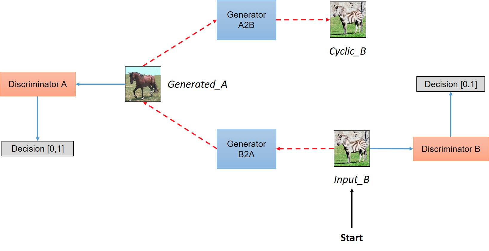
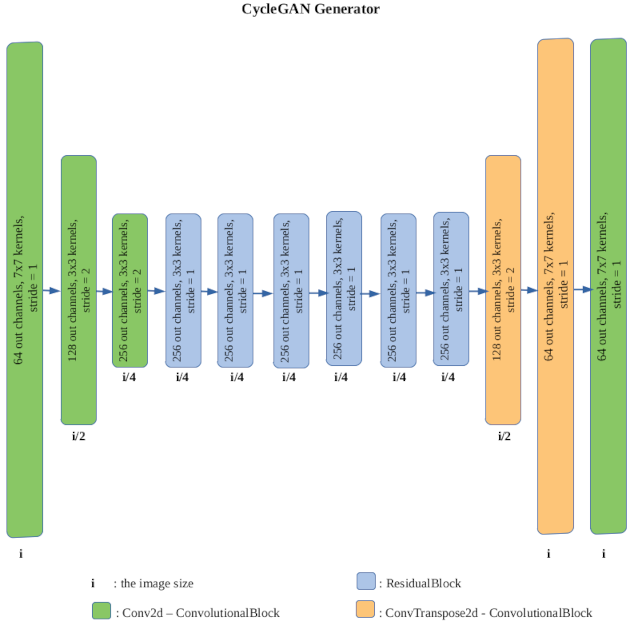
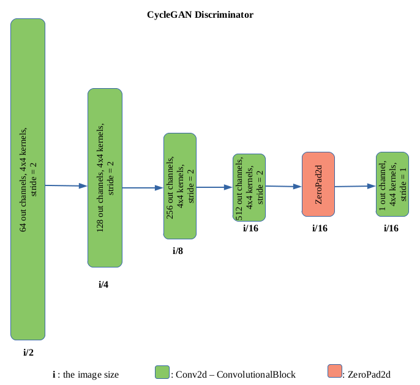
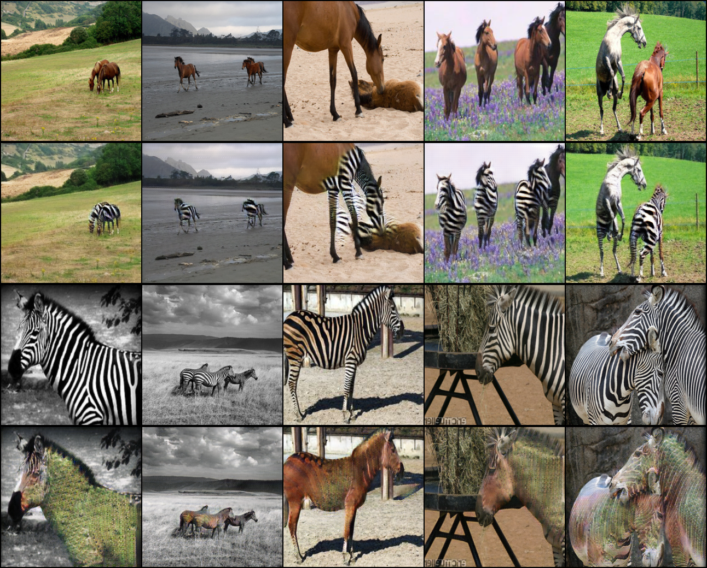
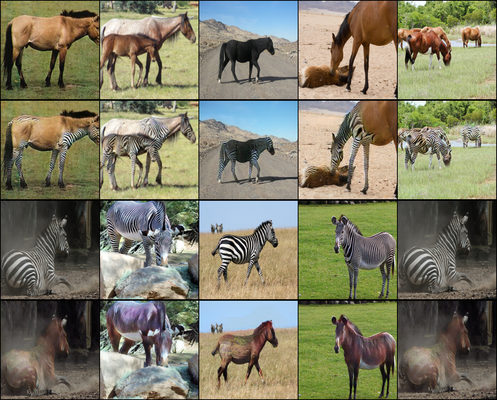
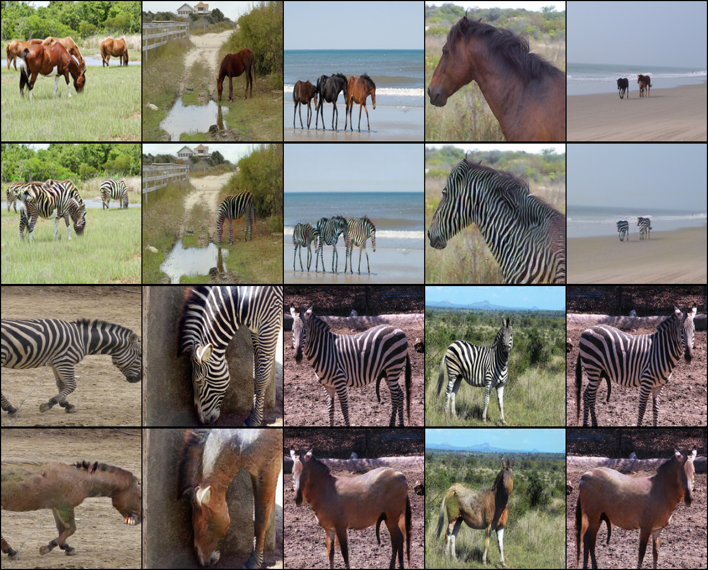

# The CycleGAN Notebook
In this project, I focus on the implementation of a cycle generative adversarial network model (CycleGAN) in an interactive way by using a jupyter notebook which is helpable to read and run for the training/inference of the model.
  

## CycleGAN Architecture
#### High Level
|| |
|:---:|:---:|
#### Low Level
|| |
|:---:|:---:|

 

## How It Works
The CycleGAN model takes a real image from domain A and converts that image to a fake image in domain B. At the same time, it takes a real image from domain B and then converts it to a fake image in domain A. Here are some results that I ran on the horse2zebra dataset. The first row contains real horse images (domain A). The second row contains fake zebra images(domain B). The third row contains real zebra images (domain B). The last row contains fake horse images(domain A).

|||
|:---:|:---:|
| epoch 1 |  epoch 33|
|  epoch 66 |  epoch 99 |

 

## Technologies
- Python
- Pytorch
- Jupyter notebook
- Pillow
- Matplotlib

  

## Installation and Running
    $ git clone https://github.com/nhannguyencsd/vision_cyclegan.git
    $ cd vision_cyclegan
    $ python3 -m venv venv 
    $ source venv/bin/activate
    $ pip install -r static/libraries/requirements.txt
    $ jupyter notebook
* Once your jupyter notebook is opened, you can run a training_cyclegan.ipynb or inference_cyclegan.ipynb.</li>
* If you are not able to install libraries from requirements.txt or run on any notebooks, you are welcome [run](https://nhancs.com/project/1) the model on my website.
  

## Contributing
If you found any problems with this project, please let me know by opening an issue. Thanks in advance!
  

## License
This project is licensed under the MIT [License](LICENSE)
  

## References
The CycleGAN paper: [https://arxiv.org/abs/1703.10593](https://arxiv.org/abs/1703.10593)  
CycleGAN datasets: [https://people.eecs.berkeley.edu/~taesung_park/CycleGAN/datasets/](https://people.eecs.berkeley.edu/~taesung_park/CycleGAN/datasets/)  
CNN Padding formular: [https://sebastianraschka.com/pdf/lecture-notes/stat479ss19/L13_intro-cnn-part2_slides.pdf](https://sebastianraschka.com/pdf/lecture-notes/stat479ss19/L13_intro-cnn-part2_slides.pdf)  
Model architecture 1: [https://hardikbansal.github.io/CycleGANBlog/](https://hardikbansal.github.io/CycleGANBlog/)  
Model architecture 2: [https://towardsdatascience.com/cyclegan-learning-to-translate-images-without-paired-training-data-5b4e93862c8d3](https://towardsdatascience.com/cyclegan-learning-to-translate-images-without-paired-training-data-5b4e93862c8d)  

